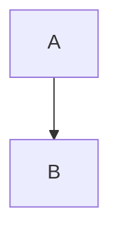

# Fuwari Blog（基于 Astro）


这是一个使用 Astro + Tailwind CSS 构建的静态博客站点。本仓库基于上游主题 [saicaca/fuwari](https://github.com/saicaca/fuwari) 进行二次定制与增强。

## 特性
- Astro 5 + Tailwind CSS
- Swup 页面切换与过渡动画
- 亮/暗色模式、主题色可配置
- 响应式布局（移动端/桌面端）
- 目录（TOC）、RSS、Sitemap
- Pagefind 本地全文搜索（构建时自动生成索引）
- 扩展 Markdown：数学公式（KaTeX）、Mermaid、Admonition、GitHub 卡片等
- 代码块增强：Expressive Code（行号、可折叠、语言徽章、自定义复制按钮、自动换行）

## 在原主题基础上的优化/增强（本仓库定制项）

以下内容以“本仓库代码实际包含的功能”为准，便于你二次维护：

- 标签显示优化：文章卡片与正文元信息处的标签支持自动换行，并对超长标签进行断词，避免横向溢出（见 `PostMeta` 相关实现）。
- Bilibili 视频嵌入指令：支持用 Markdown 指令插入 B 站视频 iframe（见 `::bilibili{bv="BV..."}`）。
- Mermaid 渲染增强：`mermaid` 代码块会输出为居中容器，展示更友好。
- 脚注体验增强：正文页对脚注标题的 i18n 与“返回引用”按钮样式做了额外处理（不修改原 DOM，兼顾 SEO）。
- 评论区（Giscus）：已接入 Giscus 评论；支持全局开关与单篇通过 frontmatter 关闭（见下文“评论（Giscus）”）。当单篇关闭时，会在评论区位置显示“评论区已关闭”的提示卡片（若全局禁用则不显示评论相关区域）。
- 随笔（Essays）：新增独立的随笔内容集合与页面（列表 `/essays/`、详情 `/essays/<date-hash>/`），并提供独立 RSS（`/essays/rss.xml`）。
    - 随笔卡片图集预览：从随笔正文中的图片自动提取，卡片顶部展示 3×3（最多 9 张），超出数量在最后一格显示 `+n`；点击图集可直接进入随笔详情；支持随笔目录内的相对路径图片（含子文件夹）。
- 外篇（Fiction）：新增独立的小说集合与页面（列表 `/fiction/`、作品页 `/fiction/<作品名>/`、章节页 `/fiction/<作品名>/<章节>/`），并提供独立 RSS（`/fiction/rss.xml`）。
    - 书架按「长篇 / 短篇 / 同人」分架，作品卡带连载状态、章节数与阅读进度；长篇作品页提供目录、「继续阅读」与已读标记；章节页有阅读进度条、上一章/下一章导航与 `←` `→` 键盘翻章。
    - 阅读位置保存在浏览器 `localStorage`（键名 `fiction:read:<作品名>`），不上传服务端。写法见下文「写作（外篇）」。
- 置顶（pin）：支持在文章/随笔 frontmatter 中通过 `pin: <int>` 置顶排序，并在列表卡片显示“置顶”标识。
- 日期时间链路增强：frontmatter 支持 `YYYY-MM-DD` 与 `YYYY-MM-DD HH:mm`；仅写日期时自动补齐默认时间（默认 `16:00`）；时区支持偏移格式（默认 `+08:00`，兼容 IANA）；页面展示按分钟精度，JSON-LD/RSS 输出机器可读时间。
- 全站毛玻璃（Glass）：支持半透明 + backdrop blur，并可分别调节卡片与面板/浮层的不透明度（见 `glassConfig.cardOpacity` / `glassConfig.panelOpacity`）。
- 文章末尾赞助按钮：在每篇文章末尾提供“赞助”按钮，点击弹窗展示赞赏码；支持全局开关与单篇关闭（见下文“赞助（Sponsor）”）。
- 侧栏标签可收起：左侧栏 Tags 超过阈值会折叠，点击“更多”展开后，同一按钮会切换为“收起”，一键恢复折叠。
- 全局鼠标特效（原生 JS）：新增全站 Canvas 鼠标动效（点击波纹 + 拖拽粒子尾迹），不依赖 React 水合；支持在站点配置中统一开关与参数调节（见下文“鼠标特效（Mouse Spark）”）。
- 新建稿件工具（`pnpm new`）：一个脚本覆盖篇章 / 笔记 / 随笔 / 外篇，既支持交互向导，也支持命令行选项（`--type`、`--title`、`--origin`、`--chapters`、`--yes`、`--dry-run` 等）；外篇会直接生成作品目录、占位章节与 `images/` 目录。
- 构建/搜索优化：`pnpm build` 会在 Astro 构建后自动运行 Pagefind；并通过 `pagefind.yml` 排除 KaTeX、搜索面板等不应被索引的内容。
- 部署工作流（可选）：提供 Gitea Actions 工作流，在 Alpine runner 上构建并 rsync 发布到指定目录（按需修改）。

## 快速开始

### 环境要求

- Node.js >= 20
- pnpm >= 9（本仓库通过 `preinstall` 强制使用 pnpm）

### 安装与运行

在仓库根目录执行：

```bash
pnpm install
pnpm dev
```

启动后访问：`http://localhost:4321/`

## 配置说明

### 路由与命名（本仓库约定）

为了更贴近“笔记/书籍”的信息架构，本仓库对首页与文章列表做了路由重组，并在 UI 文案中使用以下命名：

- **封面**：站点首页 `/`，聚合展示「最新随笔」+「最新篇章」（展示数量与顺序可配置，见下文）。
- **篇章**：原“文章列表”迁移到 `/passage/`（支持分页）。
- **随笔**：随笔列表 `/essays/`，详情 `/essays/<date-hash>/`，RSS `/essays/rss.xml`。
- **外篇**：小说列表 `/fiction/`，作品页 `/fiction/<作品名>/`，章节页 `/fiction/<作品名>/<章节>/`，RSS `/fiction/rss.xml`。

兼容性：旧的 `/<page>/`（原首页分页）会跳转到 `/passage/<page>/`。

### 站点配置

- 主要站点配置在 `src/config.ts`：站点标题、语言、导航、作者信息、背景、TOC、许可声明等。
- 部署相关配置在 `astro.config.mjs`：
    - `site`：你的站点域名（用于 RSS、Sitemap、OG 等）
    - `base`：若部署在子路径（例如 `https://example.com/blog/`），需要设置为 `/blog/`

### 首页（封面）展示

首页展示由 `src/config.ts` 的 `homePageConfig` 控制：

- `sections`：控制首页展示哪些板块以及显示顺序（例如：先随笔后篇章 / 先篇章后随笔 / 只显示篇章）。
- `recentEssays.count`：控制“最新随笔”展示条数。
- `recentPosts.count`：控制“最新篇章”展示条数。

### 毛玻璃（Glass）

全站支持毛玻璃（半透明 + backdrop blur）。相关配置在 `src/config.ts` 的 `glassConfig`：

- `enable`：开关
- `blur`：模糊半径（px）
- `cardOpacity`：卡片区域不透明度（0~1）
- `panelOpacity`：面板/浮层不透明度（0~1）（例如顶栏弹出面板、浮层等）
- `border`：是否显示细边框

### 鼠标特效（Mouse Spark）

全站鼠标特效使用原生 Canvas 实现，相关配置统一在 `src/config.ts` 的 `siteConfig.mouseSpark`：

- `enable`：是否启用
- `color`：RGB 字符串（格式：`"R,G,B"`）
- `scale`：效果尺寸缩放
- `opacity`：整体透明度（0~1）
- `speed`：动画速度倍率
- `maxTrail`：尾迹最大点数
- `enableTrail`：是否始终显示移动尾迹
- `zIndex`：Canvas 层级

说明：当 `enable: false` 时，不渲染特效 Canvas，也不会初始化相关事件监听。

### 评论（Giscus）

已集成 Giscus 评论区：

- 全局配置：`src/config.ts` 中的 `giscusConfig`
    - `enable`：全局开关
    - `repo` / `repoId` / `category` / `categoryId`：按 giscus.app 要求填写
- 单篇开关：frontmatter 里设置 `comments: false` 可关闭该条内容（文章/随笔）的评论区（默认 `true`）。
    - 若全局 `enable: true` 但单篇关闭，会在评论区位置显示“评论区已关闭”的提示卡片。
    - 若全局 `enable: false`，不渲染任何评论相关区域。

### 赞助（Sponsor）

文章页正文末尾会渲染一个赞助按钮，点击后使用原生 `<dialog>` 弹窗展示二维码。

- 弹窗宽度会根据二维码图片大小与数量自适应（并在小屏自动限制最大宽度，避免溢出）。
- 为兼容 Swup 页面切换，按钮/弹窗采用全局事件委托方式绑定（无需额外框架水合）。

- 全局配置：`src/config.ts` 中的 `sponsorConfig`
    - `enable`：全局开关
    - `buttonText` / `title` / `tip` / `footerText`：文案
    - `methods`：赞助方式列表（`name` + `qrImage`）
- 二维码图片建议放到：`public/images/sponsor/`
    - 例如：`/images/sponsor/wechat.jpg`

## 写作（文章）

### 文章位置

文章存放在 `src/content/posts/` 下（支持多级目录）。

### 新建文章

```bash
pnpm new
```

该命令会进入交互式向导，按类型只问必要的问题：

- 类型：篇章 / 笔记 / 随笔 / 外篇（小说）
- 格式：`<slug>/index.md` 文件夹模式，或 `<slug>.md` 单文件模式（外篇固定为作品目录）
- 标题、slug（默认由标题派生）
- 分类（仅篇章/笔记，可从已有分类里选或新建）
- 标签、发布时间（默认当前时间）
- 选外篇时另有：原创/同人、原作、短篇/长篇、连载状态、简介、预建章节数

快速/非交互模式（适合脚本或一行命令）：

```bash
# 位置参数同时作为标题与 slug
pnpm new my-new-post

# 完整选项
pnpm new --type fiction --title "夜航" --origin fanfic --fandom "明日方舟" \
  --status ongoing --chapters 3 --tags "同人,星极,博士" --yes

# 只看会生成什么，不落盘
pnpm new --type posts --title "测试" --dry-run
```

常用选项：`--type`、`--title`、`--slug`、`--published`、`--tags`、`--category`、`--folder`/`--single-file`、`--yes`、`--dry-run`、`--open`、`--force`、`--interactive`。完整列表见 `pnpm new --help`。

兼容模式：

```bash
pnpm new-post <文件名或路径>
```

示例：

```bash
pnpm new-post "linux/arch-linux-setup"
```

会生成 `src/content/posts/linux/arch-linux-setup.md` 并写入基础 frontmatter（等同 `pnpm new --type posts --single-file`）。

新稿件默认写入 `draft: true`，改完内容记得改成 `false` 再发布。非交互环境下缺少必填选项会直接报错，不会卡住等待输入。

### Frontmatter 示例

```yaml
---
title: 我的第一篇文章
published: 2026-02-01 16:00
description: "一句话简介"
image: "" # 可填图片路径（如 ./images/cover.jpg）
tags: [Linux, Astro]
category: "随笔"
draft: false
lang: "" # 仅当文章语言与站点默认语言不同才需要设置
comments: true # 是否开启评论（默认 true）
sponsor: true # 是否显示赞助按钮（默认 true）
---
```

`published` 支持 `YYYY-MM-DD` 与 `YYYY-MM-DD HH:mm`；推荐使用精确到分钟的时间格式。

## 写作（随笔）

### 随笔位置

随笔存放在 `src/content/essays/` 下。

### Frontmatter 示例

```yaml
---
published: 2026-02-01 16:00
title: "" # 可选；为空时 UI 不展示标题，但会用于 SEO/搜索派生标题
tags: [随笔]
pin: 0 # 可选；>0 则置顶排序
comments: true # 是否开启评论（默认 true）
draft: false
slugSeed: "" # 可选；用于稳定 URL（不填则从标题/正文派生）
---
```

随笔详情页路由采用“发表日期 + 标题/正文派生 seed 的 hash”，格式类似：`/essays/YYYY-MM-DD-xxxxxxxxxx/`。

### 图集预览（随笔卡片）

随笔不需要单独的封面字段。

- 只要你在随笔正文里按 Markdown 语法插入图片（包括相对路径，例如 ``），列表页卡片就会自动提取这些图片作为图集预览。
- 预览最多显示 9 张（3×3），超出部分会显示 `+n`。
- 正文图片渲染保持不变；图集仅用于列表卡片。

## 写作（外篇）

外篇用来放小说，短篇、长篇（分章连载）与同人共用一套结构。

### 外篇位置

- 作品资料：`src/content/fiction/<作品名>/index.md`
- 章节正文：`src/content/fiction/<作品名>/chapters/00001.md`（文件名固定为 5 位定长序号，前导零写全，序号决定章节顺序；不要求写章节标题，标题写在 frontmatter 的 `title` 里）
- 作品图片：`src/content/fiction/<作品名>/images/`，封面字段写相对路径，例如 `images/cover.jpg`

用向导创建外篇：

```bash
pnpm new --type fiction --title "作品名" --origin original --status ongoing --chapters 3 --yes
```

会生成作品目录、`index.md`、`chapters/00001.md` 起的占位章节和 `images/` 目录，改完把 `draft` 改成 `false` 即可。

### Frontmatter 示例

```yaml
---
title: "XXX"
origin: original # original 原创 / fanfic 同人（必填）
published: 2026-09-19
status: ongoing # ongoing 连载中 / complete 已完结 / hiatus 停更；不写时按有无章节推断
synopsis: "一句话简介，会显示在作品页与 RSS。"
cover: "images/cover.jpg" # 可选，留空则卡片显示占位块
series: "" # 可选，系列名
tags: ["A", "B", "C"] # 人物、原作标签、题材都写在这里
comments: true
draft: false
---
```

`origin` 为 `fanfic` 时还要加一行 `fandom: "原作名"`（必填）。

章节文件只需 `title` 与 `published`（也可写 `updated`、`comments`、`draft`）。

### 归类规则

- 作品目录下**没有** `chapters/` 或章节为空，且 `origin: original`，归入「短篇」。
- 有章节，或 `status` 写了 `ongoing` / `hiatus`，归入「长篇」。
- `origin: fanfic` 一律归入「同人」。
- 作品页正文（`index.md` 的 `---` 之后）可以写作品说明或序，会渲染在简介下方。

### 阅读体验

- 书架按「长篇 / 短篇 / 同人」分架，作品卡显示连载状态、章节数与阅读进度条。
- 点书架上的作品先进作品页（简介与详情），长篇再从「开始阅读」进入正文；读过之后按钮会变成「继续阅读 · 03」。
- 作品页有目录、字数、最后更新与「继续阅读」入口，目录里会标出已读章节。
- 章节页顶部有阅读进度条，底部是上一章 / 目录 / 下一章，桌面端支持 `←` `→` 翻章；读到最后一章时，下一章的位置显示「已是最后一章」。
- 阅读位置记在浏览器 `localStorage`，键名为 `fiction:read:<作品名>`，只在本机生效。
- 侧栏标签按板块过滤：`/fiction/` 只列外篇标签，`/notes/`、`/essays/`、篇章页同理；首页与目次是聚合页，列篇章/笔记/随笔的标签。
- 外篇标签可点，链接形如 `/fiction/?tag=叶洛华`，进入书架后只留下带该标签的作品，没有命中的分区自动收起。

## Markdown 扩展语法

### Admonition（提示块）

```md
:::note[可选标题]
这里是内容。
:::
```

支持的类型：`note` / `tip` / `important` / `caution` / `warning`。

### GitHub 仓库卡片

```md
::github{repo="owner/repo"}
```

### Bilibili 视频嵌入

```md
::bilibili{bv="BVxxxxxxxxxxx"}
```

### Mermaid

````md

````

### 数学公式（KaTeX）

- 行内：`$E=mc^2$`
- 块级：

```md
$$
\int_a^b f(x)\,dx
$$
```

## 搜索（Pagefind）

- `pnpm build` 会在 `astro build` 后自动执行 `pagefind --site dist` 生成搜索索引。
- 排除规则见 `pagefind.yml`（例如 KaTeX 渲染节点、搜索面板等）。

## 常用命令

| 命令 | 作用 |
|---|---|
| `pnpm install` | 安装依赖 |
| `pnpm dev` | 本地开发（默认 `localhost:4321`） |
| `pnpm check` | Astro 检查（类型/内容等） |
| `pnpm build` | 构建（含 Pagefind 索引） |
| `pnpm preview` | 预览构建产物 |
| `pnpm new` | 新建稿件（篇章/笔记/随笔/外篇，交互或带选项） |
| `pnpm new-post <name>` | 新建篇章单文件（兼容/快速模式） |
| `pnpm format` | 使用 Biome 格式化 `src` |
| `pnpm lint` | 使用 Biome 检查并自动修复 `src` |

## 部署

### 通用方式

Astro 支持部署到 Vercel / Netlify / GitHub Pages / 自建服务器等。部署前请先修改 `astro.config.mjs` 中的 `site` / `base`。

### GitHub Actions（本仓库自带，可选）

本仓库提供了 GitHub Actions 工作流：`.github/workflows/deploy.yml`。

- 触发：推送到 `main` 分支
- 构建：分别输出 `dist-cn` / `dist-com`，并生成 Pagefind 索引
- 部署：
    - Cloudflare Pages（`dist-com`）
    - 服务器 rsync 增量推送（`dist-cn`）

需要在 GitHub 仓库设置中配置以下 Secrets（Actions → Secrets and variables → Actions）：

- `CLOUDFLARE_API_TOKEN`：Cloudflare API Token（需有 Pages Deploy 权限）
- `CLOUDFLARE_ACCOUNT_ID`：Cloudflare Account ID
- `CF_PAGES_PROJECT`：Cloudflare Pages 项目名

服务器 rsync 增量部署需额外配置以下 Secrets：

- `DEPLOY_HOST`：服务器地址（域名或 IP）
- `DEPLOY_USER`：SSH 用户名
- `DEPLOY_PASSWORD`：SSH 密码（GitHub Actions 中通过 sshpass 使用）
- `DEPLOY_PATH`：服务器目标目录（例如 `/home/blog/web`）
- `DEPLOY_PORT`：SSH 端口（可选，默认 22）

可选说明：

- 若不需要 rsync 部署，可删除工作流中的 `Deploy to server (rsync)` 这一步。
- 若仅想保留 Cloudflare 部署，可移除 `Build (CN)` 这一步。

### Gitea Actions（本仓库自带，可选）

本仓库提供了一个 Gitea Actions 工作流：`.gitea/workflows/deploy.yml`。

- 触发：推送到 `main` 分支
- 动作：安装依赖 → `pnpm build` → 将 `dist/` 同步到目标目录
- 默认目标目录：`/home/blog/web`（按需修改工作流中的 `TARGET_DIR`）

## 致谢

- 上游主题：Fuwari（https://github.com/saicaca/fuwari）

## 许可

本仓库采用“代码许可 + 内容许可”双许可：

- **代码（主题/站点实现）**：MIT License，见 [LICENSE](./LICENSE)
    - 基于上游主题 Fuwari（MIT License）进行二次定制，使用/再分发时请保留许可与署名。
- **内容（文章/随笔/图片等）**：CC BY-NC-SA 4.0，见 [LICENSE-CONTENT](./LICENSE-CONTENT)
    - 转载/改编需保留署名，并附上原文链接（源站 URL）或本仓库链接；不得用于商业用途；改编需同许可共享。
    - 外篇（`src/content/fiction/`）不在此列：原创保留全部权利；同人另按二次创作的常规声明处理。

注：仓库中可能包含第三方依赖与资源文件，其许可与权利声明以原作者/原项目为准。