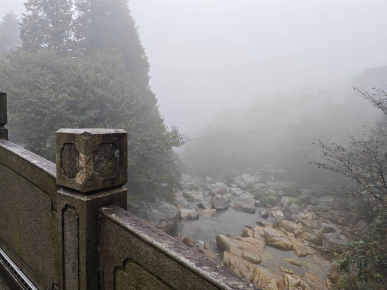
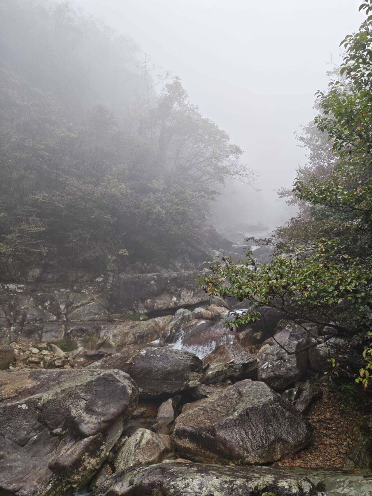
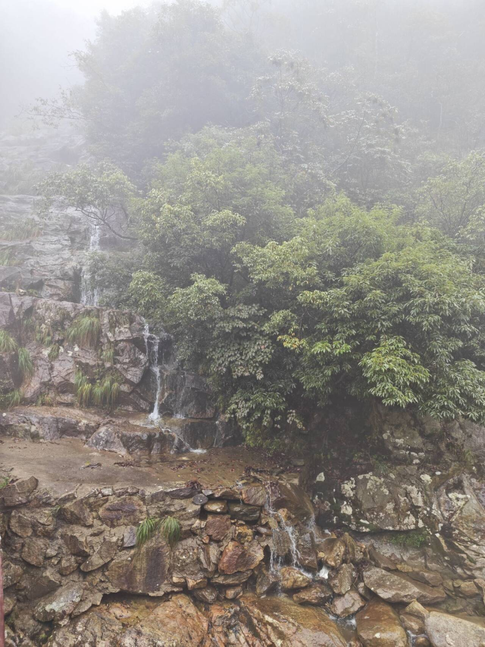
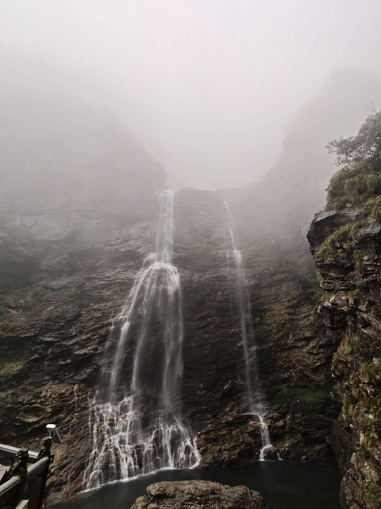
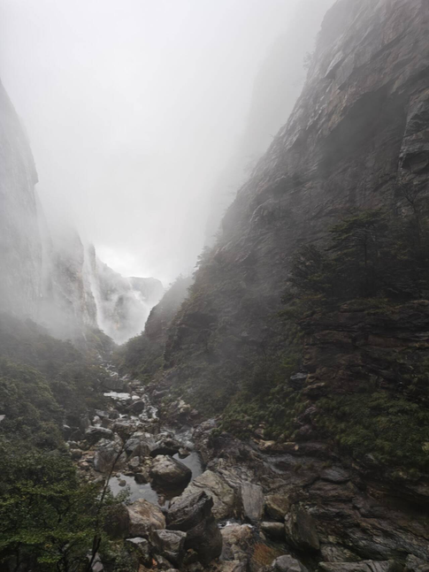

> 人总是要量力而行的，去三叠泉的路就很适合作为一个生动的教材——据说女娲补天时，庐山文旅偷走了一堆石头，铺成了到三叠泉的步道，导致女娲缺少材料才把自己补了进去。相比于呆板的青石板路和与自然格格不入的水泥路，庐山文旅别具一格地选择了用水泥和大小各异的石头在山间铸就起一条扎紧庐山束腰的步道。凹凸不平的石头会轻轻按摩旅人的脚底，与旅人一起舞蹈着一同前往这段旅程。或者我们用另一种通俗易懂的表述——脑子得铁了用选择了一种又麻烦又硌脚雨天还他妈容易滑倒的道路作为落差几百米的步道。

空幽的山谷，潺潺的溪流，氤氲的云雾，星点的秋雨在人行步道上落下悦动的舞步。这是我们早起访庐山真面目的地图。

没有想象中的鸟鸣，但是流水冲刷山谷的白噪声和着秋雨与云雾的舞蹈，也让足以让人眼前一亮。步道与观光小火车的轨道一高一低，交织错落，像庐山束腰的两条编织的丝带，如害羞而含苞待放的少女，将云雾织成的半透明白纱裙牢牢系紧。

我们清晨出发时初霁，中途微雨，一路上走着唱着，虽无「竹杖芒鞋轻胜马」的装备，撑起一支伞，也可有「谁怕，一蓑烟雨任平生」的从容。走到 1300 级台阶的步道时，雨水也开始撒泼似的，开始淅淅沥沥然后叮叮咚咚乒乒砰砰砸了下来，苏子瞻看了也要写出一句「谁怕？这谁不怕？」撑着伞，迎着山间的风，面对陡峭线下的 1300 级湿滑台阶，体力已是最简单的一关，就怕心头一松，脚下一滑，摔得个东一块西一块，便可告别这美好的世界。

在每段下坡后的平台走走停停，几经短休，我们见到了三叠泉的真身：背后，是在云雾中看不到顶、不可识真面目的叹息之墙，如神明的护卫矗立在山谷中。两岸连山，略无阙处，只在三叠泉的位置，大自然的鬼斧落下，一道堑钩带着流水，连着庐山密林中的落花一并飞流直下，然而不到三千尺，却又两次落入峭壁的怀抱中，欢愉缠绵后才落入龙潭，顺着山涧继续向前漂流。

