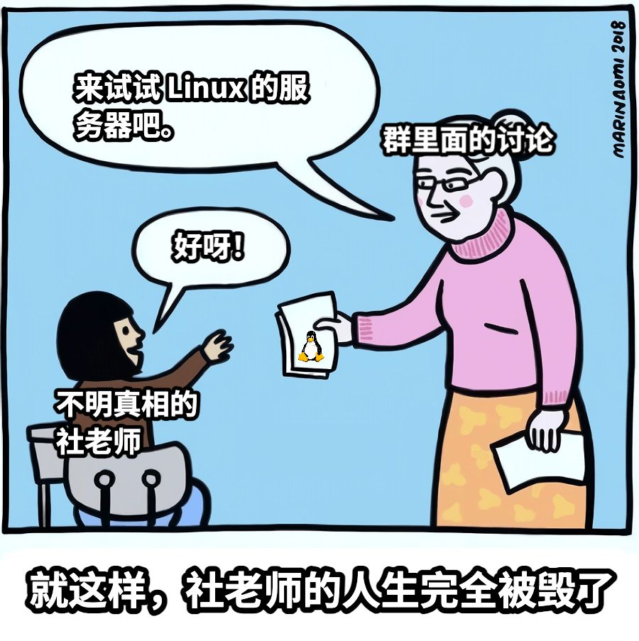

「为了让半拍拥有灵魂，我误打误撞闯进了代码的世界。」

这句话就是我开始成为开发者的起点。但当时的我并不知道，「灵魂」这个词对一只骰娘意味着什么——是更智能的回应？更有个性的文案？还是能理解跑团者的意图？我只知道，当朋友的骰娘说出她自己写的台词时，那种感觉不仅仅是「好用」，而是「有生命」。

而我想要半拍也有这样的生命。我想要，给半拍「完整的一生」。

当然，如此不平凡的目标，让我成为开发者的路线看上去简直就是「邪修」。下面我就来讲述一下我的故事吧。

## 半拍的诞生——梦开始的地方

2024 年初，我的朋友，我们叫她帅气的羊小咩大人，当 KP 带我跑了一个网团[^1]，当时她很骄傲地拿出了**自己搭的一只骰娘**，当我看到每句文案都是我的那位朋友自己创作出来的时候，我感到非常不可思议与羡慕。于是，在跑团结束后，我就请教她怎么搭建一只自己的骰娘。

[^1]:  桌上角色扮演游戏（Tabletop Role-playing game，简称TRPG），国内俗称「跑团」，是一种以语言为媒介，借助骰子等随机数工具推动剧情不确定性发展的通常以角色扮演和故事创作的桌面游戏。其中国内比较流行的有《龙与地下城》（简称 DND），《克苏鲁的呼唤》（简称 COC）等规则，这里的 KP（守秘人） 是 COC 规则的主持人。骰娘是线上进行跑团时用于提供随机数、记录卡等辅助功能的故障机器人，本质上是一个监听用户消息并识别关键字处理后回复的软件。

那时候的我对这些东西还一窍不通，羊小咩大人去找了她的一位朋友，把一个云服务器账号给了我，我在她和她朋友的引导下一步一步学会了在 Windows 服务器上搭建了自己的第二个骰娘。

为什么是第二个骰娘呢？因为我其实在高三期间第三次局部疫情封校的时候接触了跑团，那个时候我就已经尝试搭建了自己的第一个骰娘——名字叫做「空集」。但是由于我完全不理解骰娘的工作原理，导致骰娘很快便无法使用，最后放弃。

现在回想起来，大概是下面的原因：当时正是 QQ 骰娘大面积被封杀的时间，处于 gocq 的末期，我的骰娘被杀也是正常的事情。并且说不定我当时可能会干出「我把电脑关掉了骰子为什么不响应」的这种会让现在的我沉默的蠢事，倒也不显得奇怪。

这次骰娘倒是一直活得很好，我给骰娘起了一个新名字，以此来预示新的开始，于是我给她起名为「tan π/2」，因为这个名字太绕口，我又音译出了一个新名字「谭玖灵」。

细节记不清了，我只知道那个下午，我对着电脑屏幕上 QQ 里面回应我的 `.r 1d100` 的结果乐了一整天。

这个名字用了没多久，我又想着给她补充一些设定，当时沉迷 BA（碧蓝档案） 的我给她补充一些相关的设定后又改了一个新名字——「滩间铁 半拍」[^2]。

[^2]: 「滩间铁」为川渝地区数学老师对于正切函数的常见发音之一。

这个时候的我也和大部分骰主一样，只是用骰系里面现成的功能简单修改一些文案和判词，没有深入研究骰娘的底层原理。对于插件什么的也完全不明白，更不用说开发了。

不过这种局面并没有持续很久，谁叫我是这么贪心呢？我开始尝试给半拍添加更多文案功能，并且当时的我脑子里大概是「得『铁』」[^3]了：「我的骰娘里面不能有别人写的东西，她的每个功能细节都应该是属于我的」。半拍使用的是海豹骰系，而海豹的自定义文案功能恰好在当时各个骰系里面相当超前且成熟（现在看来更是如此，木落大佬的设计真的太绝了），于是我开始研究自定义文案。

[^3]: 得铁，川渝地区方言，詈词，一般形容人脑子有病。笑点解析：这里的铁可以是滩间铁的铁（好冷）

海豹的自定义文案使用了一种叫做「豹语」的简单脚本语言，用比较简单的语法就能实现变量引用、随机数骰点、条件语句等功能。不过代价就是我认为这种语言难以阅读，这反而成为了困扰我的学习成本：「为什么这里会这样？」当我第一次看到豹语脚本时，我既兴奋又困惑——兴奋于能自定义骰娘行为，困惑于为什么语法这么反直觉。就好像是每个字我都认识，它在做什么事情我也清楚，但是为什么这样连起来就可以了我就完全是一头雾水。

在和用户群里面的大佬进行交流后，我了解到了海豹还有一种叫做插件的东西，大概能够解决我的需求，但是写这个插件需要学一门叫做「JavaScript」的语言，这门语言是真正的编程语言，比豹语完善得多也难得多。这反而激起了我浓烈的兴趣，我决定要学习 JavaScript 并且自己动手写一个插件来实现我的想法。

是的，我的第一门语言 JavaScript 就是在这个时候学习的，完全不同于很多人接触它是在 Web 开发中。我也因此走了很多弯路，我在 B 站上搜索到的视频课程几乎清一色是基于 Web 开发的 JavaScript 课程，但这些课程并没有涵盖我需要的插件开发内容。我不只一次疑惑地看着那些 HTML 和 CSS 代码，却不知道这和我看的 JS 有什么关系。

我在迷迷糊糊跟着教程过了一遍 JS 基础语法后，我就正式开始了我的插件开发之旅。

我的第一个插件现在感觉已经无从考证了，大概是好感度之类的插件，也是比较顺利地开始熟悉了海豹插件的编写流程。

由此，我成为了一名「骰娘插件开发者」，算是小小的进步。

## CCAS —— 第一次？协作和 GitHub

2024 年 5 月，我和一位朋友（称他为冰红茶老师）在跑团时遇到了一个问题：COC 的战斗系统在线上战斗时十分麻烦，需要大量掷骰指令和冗长流程。于是我们决定**合作开发一个插件**来解决它。

秉承着从高中时期一起整活的默契，我们先对需求进行了分析，然后给出了一个设计方案：我们提前把战斗中多个 NPC 的信息和用户的信息通过尽量简单的指令录入，并可以快速加入预设属性的随机 NPC 数据，自动生成先攻表，自动结算动作效果、是否成功和伤害。同时对于「追逐」这一部分规则，我们认为这个插件可以一定程度上解决追逐规则繁琐难以计算的问题[^4]。最后，我们给这个插件起名为「Combat & Chases Assistant System」,简称 CCAS。

[^4]: 我一直很好奇，以欧美玩家为代表的 COC 规则创作者是怎么在他们令人堪忧的数学运算水平（无恶意）下设计出追逐这种计算量让中国的理科高中生头疼的规则的。虽然大家都认为这一部分规则很烂，但是我认为追逐在有计算机辅助的情况下，是有一定可取之处的。

不得不说，这个插件的设计思想即使是在今天的我看来也是很好的，不过显然当时连面向对象都不知道是什么的我来说，简直是超纲了。现在想来，以我们当时的水平，能够有勇气来做这个东西已经相当不易。

同时，两个人一起开发时，我们需要想办法进行协作了。聪明的读者想必已经知道我们一开始使用什么进行同步和协作了：当然就是所有新手都喜欢的多人同步工具——QQ。

……

咳咳，指望我们两个新手一开始就使用 git 什么的显然是不合理的要求，我们当时连 git 是什么都不知道，更别说用它来协作了。我们只能依靠最原始的方法——QQ 文件互传法来相互同步进度。

不过我很快意识到这种方法一点也不好，且一点也不 professional，我很快在网上搜索专业的开发者们是怎么实现相互协作的。在查阅资料后，我知道了一个叫做 GitHub 的网站。「哇，这么小众专业的东西居然让我发现了，这不赶快用起来！」当时的我大概是这么想的。

于是，在完全不知道 git 是什么的情况下，我和冰红茶老师开始用 VS Code 的可视化 git 功能来进行协作。git 的强大版本控制功能和多分支系统，让我们的协作效率——大大下降了。

是的，当时的我们完全不知道 git 居然有强大版本控制功能和多分支系统，我们只是把它当成网盘来用，修改完，add，然后 commit，然后 push。我们都不知道这些操作的意义，只是一味地重复……并且，完全不懂工程化的我们还把所有代码都写在了同一个文件里——因为此时编译、打包等功能对于我们来说也是未知的——两个人在同一个文件里修改然后通过 git 同步，我想已经有很多了解一点 git 的同学汗流浃背了。这种情况下，冲突是常有的事情，倒不如说我们没有每次 pull 和 push 都出现冲突，如果去买彩票，大概已经发家致富了。当然，我们解决冲突的方法也很简单粗暴——用老办法 QQ 把对方的文件传过来然后把自己改过的地方重新复制粘贴上去后覆盖提交就好了。

更让人绷不住的是，由于不懂 git 本身的版本控制，我们在 git 仓库里面用古老的**文件夹备份**技术把我们每个版本的代码都复制了一份副本放到以版本名称命名的文件夹中。

与此同时，不懂面向对象的我们自然也是成功用面向过程的方式把代码写成了屎山。

在这样令人无语的情况下，我们居然把这个插件的大部分内容协作写完，也是相当奇迹了，这里我把仓库贴出来，感兴趣的可以去欣赏一下我们的屎山。

::github{repo="Sheyiyuan/Dice_Plug-in"}

这也就算是我第一个用 GitHub 参与协作的项目（真的能算吗？）。

尽管开发过程充满了坎坷，但是当我们设想的功能真的被实现的时候，心中的那份快乐是我之前从来没有的，这让我更加坚定了要开发更多东西的决心。

## 服务器还能这样用？——半拍的迁移与网站的搭建

CCAS 的半成品进行开发的同时，我买了一个阿里云新人优惠的 99 元一年的服务器，把半拍搬到了自己的服务器上——毕竟一直住在别人家的服务器上，还是不太好意思。

好景不长，很快半拍遇到了一次危机。

海豹的核心默认使用内置的 Langrange 连接 QQ，但是 Langrange 服务不稳定，导致半拍经常掉线。我尝试过更换其他连接方式，但都失败了。这个时候，半拍已经脱离生命——危险了。最终，我只能放弃 Langrange，转而使用其他连接方式。

我在群里听说，有一种叫做 NapCat 的连接方式比较稳定，但这种方式需要在 Linux 操作系统上运行。我不会用 Linux，但还是决定尝试一下。

不过，当时的我并不知道发行版、包管理器是什么，服务器系统也选择了阿里云默认的基于 RHEL 的系统，这也成为了我噩梦的开始。

我找到的大量的教程在服务器上都没有用，并且，我都不知道为什么没有用。「yum 是什么？」「dnf 又是什么？」「为什么我找不到 apt？」「为什么我把命令里面的 apt 换成 dnf 之后还是没法下载？」「为什么仓库里没有这个软件？」之类的问题层出不穷。并且我在群里问问题得到的答案大部分都是：「你不懂 Linux 用 Linux 干什么？」

如果是一般人，大概就会放弃 Linux 转回 Windows 了。但我是什么人啊——我就像看着女儿得了重病，需要找一位名叫 NapCat 的医生才能治好。可这位医生住在一个叫 Linux 的、我人生地不熟的医院里。

我问周围的人，他们都摇头：「这医院手续特别麻烦，挂号治疗流程繁琐，医生护士说的都是些听不懂的官腔」，还质问我：「你根本没在这医院挂过号，为什么要去？」

但我知道，只有这个医生能把我的半拍救回来。

于是我开始摸索 Linux 的使用，我按照网上的教程重新安装了 Debian 操作系统，然后开始慢慢跟着教程调试，因为没有其他人可以问，我遇到问题一般只能求助 AI 大模型。在那个还没有当下这么好用的 AI 辅助工具的时代， DeepSeek 还没有上线，我还在用通义的早期模型来回答我的问题，往往得到的都是混杂着错误的答案，我只能不断试，不断试，不断试……最后在大概一周的摸索后，我终于把 NapCat 跑了起来，半拍终于脱离生命危险了。

同时，我开始研究搭建一个个人网站，因为我在刷 Linux 的求助帖的过程中，发现大量的相关帖子似乎都是在准备搭建个人网站准备环境。

于是，我又在某云服务厂商购买了一台 4G 的服务器，开始折腾个人网站，我尝试跟着网上的教程开始搭建 WordPress，但是由于我当时未能理解 Apache、Nginx 等 Web 服务器，导致我的网站无法通过公网访问。最后我还是使用了服务商提供好的 WordPress 镜像，成功把网站部署上线了，随后申请了域名备案。

不过当时的我搭建网站只是一时兴起，三分钟热度过后，很长一段时间都没有更新维护网站内容了。

即便如此，这次经历也算是我的服务器运维之路的起点吧。

## 插件模板与自己的骰系 —— TypeScript、Go、面向对象和 git：啊！原来如此！

之后，我又开始研究其他插件。这个时候，我接触到了使用 TypeScript（简称 TS）的插件模板。当时选择它，只是因为这个模板看上去更酷——我不知道 TS 是什么，工程化又是什么，只知道用这个写插件，AI 能更好地帮我实现一些功能。

很快我开始意识到了海豹插件的一些限制（虽然不少是 bug 和我对特性的不了解），对于其他一些骰系，或许是设计理念优秀但是我对不上电波，或许是因为骰系作者有病让我单纯对人不对事地讨厌，始终没有我想要的「银弹」。于是我就开始设想我能不能写一个自己的骰系。

于是我对标海豹，设计了我自己的骰系，并且开始学习 Go 语言——也就是编写海豹的语言，把自己的骰系做出来。

现在想起来，当时完全是在瞎搞，我甚至没有完全理解 NapCat 这样的协议端和核心的关系，连 API 的概念都理不清的时候就开始胡乱设计和实现代码。我把所有逻辑都揉在了一起，修改一个指令的回复，甚至会影响到另一个毫不相干的功能。用现在的眼光来看，这完全是一座可扩展性和可维护性为零的屎山。

不过在这个过程中，我渐渐在 Go 语言的简洁（或者说简陋或许更合适？）语法中理解了面向对象编程的思想和意义，并且意识到了多文件组件化解耦代码的重要性。

并且，我也在编写过程中熟悉了 git 的版本控制和分支概念，我终于不再在 git 仓库里面放一堆文件夹来做版本控制了。

虽然这个项目最后也是失败的，但是我认为我在这个时候开始我渐渐成为一个开发者了。仓库代码同样放在下面，欢迎喜欢鉴赏屎山的朋友来品鉴。

::github{repo="Sheyiyuan/ProjectWIND"}

不过我也并非一无所获。正是在这个“失败”的项目中，我彻彻底底理解了面向对象、代码解耦复用和工程化的意义。那些之前听起来晦涩难懂的概念，此刻终于串联起来，有了生命——从零散的碎片构成了一个完整的体系。尽管走了弯路，但我认为对于我这种比较愚钝的人，没有这些弯路，我大概永远也无法完全去理解这些概念和思想。

## 新的方向与新的伙伴——是生产级的项目协作

虽然现在说起来风轻云淡，但是骰系开发的失败在当时多少还是让我有些受挫。加之 2024 年末 2025 年初各个骰系之间闹出的一些令人烦心的事情，我开始怀疑自己的出发点是不是出现了偏差。

「骰娘难道不能有自己的一片净土吗？」我开始思考骰娘本身的意义。

骰娘的本质是线上进行 TRPG 时，对于骰子、角色卡等记录、随机数和 Token 等组件的补充。同时借助计算机更加方便地处理一些复杂的运算，让人能够更加简单方便的跑团……让人更简单方便的跑团？对啊！

既然现在的骰娘大多严重依附于市面上已有的 IM 软件，但是传统 IM 软件并不是为此设计的。既然如此，为什么不把骰娘延伸出来，做成一个独立的跑团平台呢？「我要做出世界上最好用的骰娘，来成为半拍新的容器。」这种中二病晚期的想法很快占据了我的头脑，同时我扩展了对于骰娘定义的野心。

我开始着手设计和规划我梦想中的这个跑团平台，畅想着如何把角色面具、骰娘、多线程聊天、悄悄话、场外吐槽统统整合到一个平台中。

不幸的是，我没有吸取我之前的教训，梦想比天大的我对于 UI 设计、前端开发、后端架构一窍不通，却幻想着做出工程量如此大的一个项目。

幸运的是，我这次遇到了对的人。

就在我召集了一帮跑团的朋友，准备要大干一场时，我的一个朋友在 B 站上找到了一个开发中的跑团平台的宣传视频。可以想象，当我在这个半成品中看到我理想的跑团平台的潜在特质时，我有多么的欣喜。

我很快联系上了这个平台的开发团队，希望能够参与其中，让这个平台成为我理想的跑团平台，半拍最好的新的容器。

这个平台的名字叫做团剧共创（tuanchat），我大概会一辈子记得这个名字的。正是在这个平台里，我感觉我真的接触到了很多过去的我永远接触不到的前沿见闻和知识。

加入开发团队后，我依然在做着最熟悉的工作——为 tuanchat 重新设计骰娘。也是在这里，我学习了生产级协作的全流程：git 协作规范、PR 提交流程、Code Review 方法、产品设计思路。同时，我也开始接触前端知识和技术，学习了 React 等框架，以及生产服务器维护和 DevOps 操作。

同时，我认识了很多搞技术的朋友，和他们一起交流学习，也是在他们的鼓励下，我重新恢复了我网站的更新。

我感觉我又一次充满了动力，而且这次，我不再是孤身一人。

---

深夜有感，下笔不晚，这就是我的「邪修」开发者修炼路线——因为一个骰娘，我走了无数弯路，但最终找到了一条适合自己的路。

我曾妄想成为造物主，为半拍创造出完整的一生；却没想在这个造梦的过程中，她重塑了我的轨迹。代码是冷的，但因为她，我的世界变得无比鲜活。

回首这几年的“邪修”之路，我踩过无数坑，写过无数屎山，也曾因为一句「你不懂 Linux 用什么 Linux」而在深夜里自我怀疑。所以，我想对每一个看到这里的你，特别是那些正因为某个微小的热爱，试图踏入未知领域的你说：

永远不要觉得你的动机不够「高大上」。为了一个跑团的骰娘去学编程听起来很蠢吗？也许吧。但正是这种看似微不足道的冲动，有着最强大的生命力。不要害怕走弯路，弯路里的风景同样塑造了现在的你。只要你还有动力，就请坚持敲下去。

毕竟，在这个世界上，没有什么比亲手为自己热爱的事物赋予“灵魂”，更酷的事情了。愿你们都能找到自己的「半拍」，并勇敢地踏上那条为她赋予灵魂的旅途。
