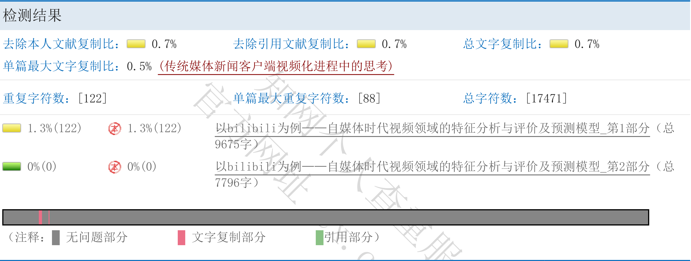

一转眼已经又是一年的时间了。虽然这一年做的事情并不算多，但也算是有一些收获吧。最后还是来总结一下 2025 年的生活和工作吧。

---

## 校内活动

校内的活动主要就是年初的统计建模大赛和一如既往的学生会工作了。

### 统计建模大赛

统计建模大赛主要还是负责前期规划和代码方面的编程，也是这个契机发现了 GitHub上的一个 b 站 API 合集，对后续的项目开发有很大的帮助。可惜这个仓库 2026 年 1 月被发函了。比赛最后也算是顺利结束了，虽然没有拿到很好的名次，但也算是积累了一些经验。

大概是我们的选题比较冷门，最后的查重率高达 1.3%，所以感觉没进到国赛也挺正常的。

### 学生会工作

然后就是不怎么愉快的学生工作了。原本是不准备留任学生会的，打算副部长当完就不留任了，但是看着学生会这边连其他留任的人都没有还是怪可怜的，就又继续留任了一年。虽然留任后感觉书记的工作做起来很枯燥且无味，并且与新的老师和下级部长的对接交流也并不顺畅，但总的来说还是完成了任务。现在基本上就是把手上的工作还是认真做好，等着交接了。

主要是和新的指导老师不太对得上电波了，感觉工作很累，没有自主权。希望下半学期不要这么痛苦。

还有另一个比较重要的校内活动是找校内的老师做了一个统计相关的软件项目开发，由我来担任项目负责人，这个在后面章节里面再说吧，这里就不多赘述了。

学习方面我已经摆烂了，主要是把精力放在了项目开发和个人兴趣上面了。毕竟之后就算要考研，现在统计学 80% 的专业课对我来说也是完全没用。

## 个人项目

这一年的个人项目可以用潦草来形容。

4月的时候跟着教程用 Godot 做了一个类杀戮尖塔的肉鸽卡牌游戏 Demo，虽然完成度不高，但也算是入门了 Godot 的开发流程和 GDScript 的语法。原本计划在这个基础上继续开发下去的，但后来因为各种原因就搁置了:spoiler[那是因为我故障机器人玩多了还没有启动]。

然后就是 10 月前后，因为沉迷魔裁，做了两个二创的小项目。一个是橘雪莉表情包生成器，原本是面向骰子用户写的插件，后面干脆写了个前端把网页也做了，算是个 Vue 的学习练手项目；另一个是安安素描本，从马克杯大佬的项目 fork 了一份，添加了 Linux/MacOS 支持，然后又改了一份 API 并搭配了骰娘的插件使用。这两个项目还算是有人用。后面我还搭了一个橘雪莉的公骰，把这两个插件都放上去了，果然同人骰热度就是不一样，一周的用户比半拍一年的用户都多了。

::github{repo="Sheyiyuan/ShyeriMeme"}
::github{repo="Sheyiyuan/Anan-s-Sketchbook-Chat-Box"}
::github{repo="SheyiyuanTan90/Anan-s-Sketchbook-API"}

接着是 12 月的时候，我因为不满 b 站的听歌体验，自己写了一个 b 站音乐播放器的项目。因为我:spoiler[和我亲爱的 AI]对 React 和 Golang 相对熟悉,所以我选择了 Wails 作为桌面端框架，前端用 React，后端用 Golang。这个项目目前还在持续开发中，已经实现了基本的听歌功能和播放列表管理功能，现在是我的主力听歌软件。

::github{repo="Sheyiyuan/Half-Beat-Player"}

## 团队项目

今年主要是参与了两个团队项目。一个是 tuanchat（一个 IM 跑团平台），另一个是校内找老师合作的统计软件项目。

### tuanchat

参与 tuanchat 的契机其实很有意思。当时正是 QQ 骰娘遇到比较大危机的时候，我就开始计划想要做一个独立于 QQ 并且比 QQ 好用至少 100 倍的跑团平台。原本我是打算自己找几个朋友一起做的，但是就在准备开始动手的时候，一个朋友找到了 tuanchat 在 b 站发布的早期概念视频，然后就推荐我去看看这个项目。结果一看发现这个项目已经有了比较完整的雏形，并且作者也在积极招募开发者，于是我就加入了这个项目组，开始参与开发工作。然后阴差阳错的从:spoiler[半吊子]后端转职成了:spoiler[三脚猫]前端。

tuanchat 项目里我认识了很多有趣的朋友，也学到了很多新的技术和知识。也是从这个时候我开始重新搭建我之前已经被废弃了快一年的博客，重新开始。

::github{repo="starrybamboo/tuan-chat-web"}

### 校内统计软件项目

另一个项目是校内找老师合作的统计软件项目。这个项目主要是为了解决校内某些统计分析工作中遇到的问题，开发一款易用且功能强大的统计软件。作为项目负责人，我主要负责项目的整体规划、团队协调和部分技术实现工作。我找来了在 tuanchat 开发组认识的两个同校来和我一起推进这个项目。这个项目目前还在进行中，预计会在今年年底前完成初步版本的开发。更多的细节这里就不方便透露了。

## 个人生活

#### 旅行

今年其实没有怎么出门，唯一值得一提的是五一的时候去了江苏，在南京和南通见了几个朋友，然后因为特种兵旅游回来腿断了一周。别的不说，淮扬菜确实好吃。

然后是 2026 年 1 月的时候，tuanchat 认识的朋友来了长沙，我们学校的四个 tuanchat 成员就一起带他玩了一圈长沙。运气比较好，这几天长沙的天气都不错，还去了橘子洲头和岳麓山，我感觉还挺开心的:spoiler[那位一起夜爬岳麓山的客人在爬不动的时候可能也会这么想吧？]。

#### 兴趣爱好

Arch Linux 因为 N 卡驱动挂了两次，然后我又因为没有及时清理快照，把系统弄崩溃了，所以就放弃了。现在主力系统变成了 Debian。有一说一，Debian 的可玩性感觉不比 Arch Linux 差多少，而且稳定性和易用性都更好一些。之后大概会出一期关于我使用 Debian 的体验分享吧（挖坑ing）。

然后捡了点电子垃圾，给宿舍装了个路由器，让我的 8 个设备可以同时上网。本来打算搞台主机的，可惜内存涨价太厉害了，只能先放弃了。然后花了巨资来买了 4 年的服务器，把我的个人项目和博客都搬到了新服务器上面运行。

基本掌握了 Novel AI 绘画的使用方法，然后也由此搞了 OC，虽然这么搞会被某些人挂，但是其实没所谓，因为我也不打算和这些人有什么交集。Novel AI 和 Nano Banana 感觉会很快让 AI 绘画普及开来，毕竟门槛真的太低了，未来可期，这个真可以战个未来吧。

跑团方面，我基本上已经完全从线下团转移到线上团了。毕竟大学就快结束了，线下团也不太现实了。

#### 精神状态

说实话，从 11 月到现在我写稿的时间里面，我的精神状态一直比较差，也不知道是什么原因。感觉整个人不太能提起精神，做事效率也很低。希望能尽快调整过来吧。这也就是我很长时间没有更新博客的原因了。

---

以上，希望明年能更好。也提前祝新年快乐。