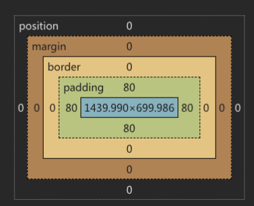

# 盒子模型

所有的元素都被一个个的「盒子」包围着，学会盒子模型可以实现准确布局、处理元素排列的关键。

在 CSS 中我们有几种类型的盒子，一般分为区块盒子（block boxes）和行内盒子（inline boxes）

| 特性  | 区块盒子 | 行内盒子 | 行内块盒子 |
| --- | --- | --- | --- |
| 换行行为 | 会产生换行，独占一行 | 不会产生换行，与其他行内元素并排 | 不会产生换行，与其他行内元素并排 |
| 宽高属性 | `width` 和 `height` 属性可以生效 | `width` 和 `height` 属性不起作用 | `width` 和 `height` 属性可以生效 |
| 默认宽度 | 不设置宽度时，默认占满父元素宽度的 100% | 宽度由内容本身决定 | 宽度由内容或设置的 `width` 决定 |
| 内外边距 | 内边距、外边距和边框在所有方向都会撑大元素 | 垂直方向的内边距、外边距不起效果；水平方向的内边距、外边距有效 | 内边距、外边距和边框在所有方向都会撑大元素 |
| 常见元素 | `div`、`p`、`h1`~`h6`、`ul`、`table` 等 | `span`、`em`、`a`、`strong` 等 | `img`、`input`、`button` 等，或通过 `display: inline-block` 设置的元素 |

## 盒子模型组成

CSS 盒模型整体上适用于区块盒子，包含盒子内容、内边距、外边距、边框四部分：

1.  盒子内容。显示内容的区域，由内容或者指定高度来决定内容大小。
2.  内边距 padding。显示内容距离边框的距离。
3.  边框 border。边框盒子包住内容和内边距。
4.  外边距 margin。该盒子与其他元素之间的距离。



## 边框

### 基础边框

border 属性用于设置盒子边框。可以设置四条或者单独边框。

```css
/*border: 边框粗细 边框样式 边框颜色*/
/*用三部分属性值组成，中间必须空格隔开*/
/*三部分属性值没有先后顺序*/
div {
  /*1像素 实线 颜色*/
  border: 1px solid #66ccff;
  /*dotted 点状边框 dashed 虚线边框 solid 实线边框 double 双线*/
}
```

border 也可以用于设置不同的边框，或者用于制作分割线等效果。

属性（方位名词）：border-top border-bottom border-left border-right

### 圆角边框

border-radius 允许你设置边框圆角（或圆形）。常用于胶囊按钮、圆角、圆形裁剪。

```css
.button {
  /*属性值为数字或百分比*/
  border-radius: 10px;
}
```

胶囊圆角：矩形设置圆角为短边的一半

圆形：正方形设置圆角为边长的一半或者 50%

特殊情况：单个的圆角

| 圆角写法 | 作用（对应四个角：左上 → 右上 → 右下 → 左下） |
| --- | --- |
| `border-radius: 10px;` | 四个角的圆角半径均为 **10px** |
| `border-radius: 10px 20px;` | 左上、右下为 **10px**，右上、左下为 **20px** |
| `border-radius: 10px 20px 30px;` | 左上为 **10px**，右上、左下为 **20px**，右下为 **30px** |
| `border-radius: 10px 20px 30px 40px;` | 左上 **10px**，右上 **20px**，右下 **30px**，左下 **40px** |

- `border-radius` 的值遵循 **顺时针** 顺序：左上 → 右上 → 右下 → 左下。
- 当值的数量少于 4 个时，会按以下规则复用：
    - 1 个值：四个角相同。
    - 2 个值：第 1 个值作用于左上和右下，第 2 个值作用于右上和左下。
    - 3 个值：第 1 个值作用于左上，第 2 个值作用于右上和左下，第 3 个值作用于右下。

## 内边距

内边距位于边框和内容区域之间。可以让盒子内容和边框保留一定距离，更美观。

内边距的属性与圆角一样，多个值用空格隔开。顺时针顺序。

| 内边距写法 | 作用（对应四个方向：上 → 右 → 下 → 左） |
| --- | --- |
| `padding: 10px;` | 上、右、下、左四个方向的内边距均为 **10px** |
| `padding: 10px 20px;` | 上、下内边距为 **10px**，右、左内边距为 **20px** |
| `padding: 10px 20px 30px;` | 上内边距为 **10px**，右、左内边距为 **20px**，下内边距为 **30px** |
| `padding: 10px 20px 30px 40px;` | 上 **10px**，右 **20px**，下 **30px**，左 **40px**（顺时针） |

单边设置同 border 一致，通过方位名词来控制：

padding-top padding-bottom padding-left padding-right

## 外边距

外边距是盒子周围一圈看不到的空间，会把其他元素推离盒子，也就是不同盒子之间的碰撞体积，用来设置盒子间的间距。

外边距的写法和内边距完全一致。

> 注意：
> 
> 1.  行内元素的左右外边距生效，上下外边距无效。
> 2.  行内元素的宽度和高度设置也无效。

块级元素可以利用 margin 实现水平居中：

1.  块级盒子必须有宽度
2.  只需要设置左右外边距为 auto 即可

```css
.box1 {
  /*左侧占满，右对齐*/
  margin-left: auto;
}

.box2 {
  /*右侧占满，左对齐*/
  margin-right: auto;
}

.box1 {
  /*两侧占满，居中对齐*/
  margin: 0 auto;
}
```

### 外边距折叠

区块元素上下外边距会出现折叠（合并）情况：

- 并列关系（兄弟）的区块元素。
- 两个上下边距将合并为一个外边距，其大小等于最大的单个外边距

```css
.boxA{
  width: 100px;
  height: 100px;
  background-color: pink;
  margin-bottom: 100px;
}

.boxB{
  width: 100px;
  height: 100px;
  background-color: pink;
  margin-top: 50px;
}

/*这里两个元素的上下外边距为 100px*/
```

### 外边距塌陷

区块元素上下外边距会出现塌陷情况。

- 嵌套关系（父子）的区块元素
- 给子盒子设置上下外边距会让父盒子塌陷移动。

子元素的上外边距会变为父元素的上外边距让父元素一起塌陷移动。

当发生塌陷时，最终的外边距遵循以下规则：

1.  **全是正数：** 取最大值（例如 20px 和 30px 塌陷后是 30px）。
2.  **一正一负：** 取两者相加的和（例如 20px 和 -10px 塌陷后是 10px）。
3.  **全是负数：** 取绝对值最大的那个（例如 -20px 和 -30px 塌陷后是 -30px）。

可以通过以下方法打破塌陷条件：

1.  **创建 BFC（块级格式化上下文）：** 设置 `overflow: hidden;` 或 `display: flow-root;`（最推荐）。
2.  **添加阻隔物：** 给父元素添加 `border` 或 `padding`。
3.  **改变定位/浮动：** 使用 `float` 或 `position: absolute;` / `fixed;`。
4.  **使用 Flex 或 Grid 布局：** Flexbox 和 Grid 容器中的子元素不会发生外边距塌陷。

## 尺寸计算

在 CSS 盒子模型的默认定义里，除了宽度和高度增加盒子大小之外，padding 和 margin 都会让盒子变大。

```css
.box {
  width: 200px;
  border: 5px;
  padding: 10px;
}
/*盒子的实际宽度为： 200+5+5+10+10=230px*/
```

`box-sizing` 用于定义元素的盒子模型计算方式，控制元素的 width 和 height 是否包含 padding 和 border。

语法：`box-sizing: 属性值`

| 属性值 | 描述  |
| --- | --- |
| content-box | 默认值。元素的 width 和 height 仅包含内容区域，不包含 padding 和 border。理解：width = 内容的宽度 |
| border-box | 元素的 width 和 height 包含内容、padding 和 border。理解：width = border + padding + 内容的宽度 |

### 标准盒模型与怪异盒模型

**标准盒模型：**

```css
.box {
  box-sizing: content-box; /* 默认值 */
  width: 200px;
  padding: 20px;
  border: 5px solid #000;
}
/* 盒子实际宽度 = 200 + 20*2 + 5*2 = 250px */
```

**怪异盒模型：**

```css
.box {
  box-sizing: border-box;
  width: 200px;
  padding: 20px;
  border: 5px solid #000;
}
/* 盒子实际宽度 = 200px */
/* 内容宽度 = 200 - 20*2 - 5*2 = 150px */
```

> 怪异盒模型起源于早期浏览器（IE5 及以下版本）的非标准实现。CSS3 引入 `box-sizing` 属性后，开发者可以自由选择使用哪种盒模型。

**推荐全局使用 border-box：**

```css
*,
*::before,
*::after {
  box-sizing: border-box;
}
```

优点：

1.  计算更直观：设置的宽度就是盒子的实际宽度。
2.  布局更稳定：添加 padding 或 border 不会撑大盒子。
3.  响应式友好：百分比宽度布局时，不用担心溢出。

## BFC（块级格式化上下文）

BFC（Block Formatting Context，块级格式化上下文）是 Web 页面中一个独立的渲染区域，拥有一套独立的布局规则。

### BFC 的触发条件

| 属性/值 | 说明 |
| --- | --- |
| `float` | 值不为 `none` |
| `position` | 值为 `absolute` 或 `fixed` |
| `display` | 值为 `inline-block`、`table-cell`、`table-caption`、`flow-root` |
| `overflow` | 值不为 `visible`（如 `hidden`、`auto`、`scroll`） |
| `display: flex` | Flex 子项 |
| `display: grid` | Grid 子项 |

> **推荐使用 `display: flow-root`**：这是专门用于创建 BFC 的属性值，无副作用，语义清晰。

### BFC 的特性

1.  独立的布局环境：BFC 内部的元素不会影响外部元素。
2.  计算高度时包含浮动元素：可以清除浮动。
3.  不会与浮动元素重叠：可以实现自适应两栏布局。
4.  阻止外边距塌陷：不同 BFC 的元素外边距不会塌陷。

### BFC 的应用场景

**清除浮动：**

当子元素浮动时，父元素高度会塌陷。创建 BFC 可以让父元素包含浮动子元素：

```css
.parent {
  display: flow-root; /* 推荐 */
  /* 或 overflow: hidden; */
}
```

**阻止外边距塌陷：**

```css
.parent {
  display: flow-root; /* 或 overflow: hidden */
}
```

**自适应两栏布局：**

BFC 区域不会与浮动元素重叠：

```css
.sidebar {
  float: left;
  width: 200px;
}

.main {
  display: flow-root; /* 不与浮动元素重叠 */
}
```

## margin 负值的应用

margin 负值是一个强大的布局技巧。

### 基本行为

| 方向 | 效果 |
| --- | --- |
| `margin-left: -10px` | 元素向左移动 10px |
| `margin-right: -10px` | 元素右侧边界向内收缩 |
| `margin-top: -10px` | 元素向上移动 10px |
| `margin-bottom: -10px` | 元素下方边界向内收缩 |

### 常见应用场景

**元素重叠效果：**

```css
.card {
  margin-left: -20px; /* 向左重叠 */
}
```

**等分布局中的边框处理：**

多个元素等分排列时，每个元素都有边框会导致边框重复：

```css
.item {
  border-right: 1px solid #ccc;
  margin-right: -1px; /* 负边框宽度 */
}
```

**圣杯布局/双飞翼布局：**

经典的三栏布局中，margin 负值用于调整列的位置：

```css
.main {
  width: 100%;
  float: left;
}

.left {
  width: 200px;
  float: left;
  margin-left: -100%; /* 移动到最左侧 */
}

.right {
  width: 150px;
  float: left;
  margin-left: -150px; /* 移动到最右侧 */
}
```

**水平垂直居中：**

结合定位实现居中：

```css
.box {
  position: absolute;
  top: 50%;
  left: 50%;
  width: 200px;
  height: 100px;
  margin-top: -50px;  /* 高度的一半 */
  margin-left: -100px; /* 宽度的一半 */
}
```

## padding 百分比的特性

padding 使用百分比时，有一个重要特性：**百分比相对于父元素的宽度计算**（无论方向）。

```css
.parent {
  width: 300px;
}

.child {
  padding-top: 10%;    /* 30px */
  padding-right: 10%;  /* 30px */
  padding-bottom: 10%; /* 30px */
  padding-left: 10%;   /* 30px */
}
```

### 实际应用

**等比例盒子：**

利用 padding 百分比特性，可以创建固定宽高比的容器：

```css
/* 16:9 视频容器 */
.video-container {
  width: 100%;
  padding-top: 56.25%; /* 9/16 = 0.5625 */
  position: relative;
}

.video-container video {
  position: absolute;
  top: 0;
  left: 0;
  width: 100%;
  height: 100%;
}

/* 1:1 正方形 */
.square {
  width: 100px;
  padding-top: 100%;
}

/* 4:3 比例 */
.ratio-4-3 {
  width: 100%;
  padding-top: 75%; /* 3/4 = 0.75 */
}
```

**响应式图片占位：**

图片加载前保持占位空间，避免布局抖动：

```css
.image-placeholder {
  width: 100%;
  padding-top: 66.67%; /* 2:3 比例 */
  background: #f0f0f0;
}
```

> 这种设计是为了保持水平和垂直方向的一致性，使得宽高比例在不同屏幕尺寸下保持不变。

## 行内块元素的空白符问题

多个行内块元素之间会出现莫名其妙的间隙。

**原因：** HTML 中的换行符、空格、制表符等空白字符在渲染时会产生一个空格大小的间隙（约 4px，取决于字体）。

```html
<div class="container">
  <span class="item">项目1</span>
  <span class="item">项目2</span>
  <span class="item">项目3</span>
</div>
```

### 解决方法

**方法一：去除 HTML 中的空白符**

```html
<div class="container">
  <span class="item">项目1</span><span class="item">项目2</span><span class="item">项目3</span>
</div>
```

**方法二：父元素 font-size: 0**

```css
.container {
  font-size: 0; /* 消除空白符间隙 */
}

.item {
  display: inline-block;
  font-size: 16px; /* 恢复子元素字体大小 */
}
```

**方法三：负边距**

```css
.item {
  display: inline-block;
  margin-right: -4px; /* 消除间隙 */
}
```

**方法四：使用 Flex 布局（推荐）**

```css
.container {
  display: flex;
}
```

## 常见问题与调试技巧

### 常见问题

**width: 100% + padding 导致溢出：**

```css
/* 问题代码 */
.box {
  width: 100%;
  padding: 20px; /* 实际宽度超出父容器 */
}

/* 解决方法 */
.box {
  box-sizing: border-box;
  width: 100%;
  padding: 20px;
}
```

**margin: 0 auto 失效的原因：**

- 元素没有设置 `width`（块级元素默认占满宽度）
- 元素设置了 `float`、`position: absolute` 或 `position: fixed`
- 元素是 `display: inline` 或 `inline-block`
- 父元素设置了 `display: flex`（应使用 `justify-content: center`）

**子元素 margin 影响父元素：**

给子元素设置 margin-top 时，父元素跟着移动（外边距塌陷）：

```css
.parent {
  overflow: hidden; /* 或 display: flow-root */
}
```

**border-radius 对不规则形状的影响：**

`border-radius` 只对有背景或边框的区域生效。如果没有背景或边框，看不到圆角效果。

### 调试技巧

**使用浏览器开发者工具：**

1.  右键元素 → 检查（或按 F12）
2.  在 Elements 面板查看盒模型图示
3.  可以直观看到 content、padding、border、margin 的大小

**可视化盒模型：**

```css
* {
  outline: 1px solid rgba(255, 0, 0, 0.5);
}
```

**全局 border-box 设置：**

```css
*,
*::before,
*::after {
  box-sizing: border-box;
}
```

## 现代 CSS 相关

### aspect-ratio 属性

CSS 新增的 `aspect-ratio` 属性可以直接设置宽高比，无需依赖 padding 百分比技巧：

```css
/* 传统方法 */
.video-old {
  width: 100%;
  padding-top: 56.25%;
  position: relative;
}

/* 新方法 */
.video-new {
  width: 100%;
  aspect-ratio: 16 / 9;
}

/* 正方形 */
.square {
  width: 100px;
  aspect-ratio: 1;
}
```

> 兼容性：现代浏览器已广泛支持（Chrome 88+, Firefox 89+, Safari 15+）

### 逻辑属性

CSS 逻辑属性提供了基于书写方向的属性，支持国际化布局：

| 物理属性 | 逻辑属性 | 说明 |
| --- | --- | --- |
| `margin-top` | `margin-block-start` | 块级方向起始边距 |
| `margin-bottom` | `margin-block-end` | 块级方向结束边距 |
| `margin-left` | `margin-inline-start` | 行内方向起始边距 |
| `margin-right` | `margin-inline-end` | 行内方向结束边距 |
| `padding-top` | `padding-block-start` | 块级方向起始内边距 |
| `width` | `inline-size` | 行内方向尺寸 |
| `height` | `block-size` | 块级方向尺寸 |

```css
.box {
  /* 传统写法 */
  margin: 10px 20px;
  
  /* 逻辑属性写法 */
  margin-block: 10px;
  margin-inline: 20px;
}
```

**优势：**

1.  自动适应不同的书写模式（如从右到左的语言）。
2.  无需为不同语言方向编写多套样式。
3.  更好的国际化支持。

### gap 属性

在 Flexbox 和 Grid 布局中，`gap` 属性可以替代传统的 margin 实现间距：

```css
/* Flexbox */
.flex-container {
  display: flex;
  gap: 10px 20px; /* 行间距 列间距 */
}

/* Grid */
.grid-container {
  display: grid;
  grid-template-columns: repeat(3, 1fr);
  gap: 20px;
}
```

**优势：**

1.  无需处理外边距塌陷。
2.  不会在首尾元素产生多余间距。
3.  代码更简洁直观。
