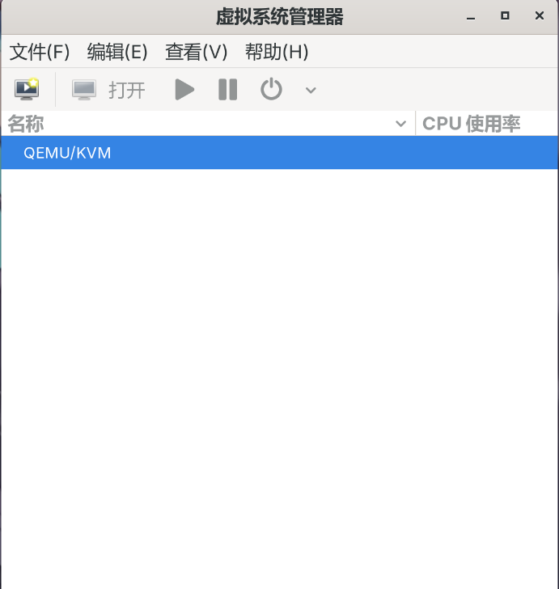

在很多时候我们会因为各种原因需要使用一些别的操作系统上的环境，在实体机上安装多个系统切换每次都需要开关机，而且文件传输也是一个问题，这个时候虚拟机就是我们的不二选择了。由于我最近正好在准备写关于系统安装的一些教程，虚拟机也能方便我准备图片素材，所以这一期我们就来讲解一下如何在Arch Linux上使用虚拟机。

## 硬件检查

在开始安装之前，我们首先要开启cpu对于虚拟化的支持。KVM依赖于CPU的虚拟化技术（如intel的`intel VT-x`和AMD的`AMD-V`），使用下面的指令查看虚拟化是否开启：

```
grep -E 'vmx|svm' /proc/cpuinfo
```

如果出现了相关内容表示虚拟化已开启，否则需要手动进入BIOS开启虚拟化，由于各品牌主板进入BIOS的方法不同，具体设置方法也有差异，这里请读者在服务商网站上自行查找开启虚拟化的方法，此处不再赘述。

## 安装KVM及其依赖

输入下面指令更新并安装KVM需要的包：

```
sudo pacman -Syu
sudo pacman -S qemu-full libvirt virt-manager bridge-utils vde2 dnsmasq
```

安装好后启动并设置开机自启服务：

```
sudo systemctl enable --now libvirtd
sudo systemctl enable --now virtlogd
```

自动开启网络：

```
sudo virsh net-start default
sudo virsh net-autostart default
```

## 添加用户权限

将当前用户添加到`libvirt`组，避免每次使用sudo：

```
sudo usermod -a -G libvirt $(whoami)
```

编辑配置文件提高权限：

```
sudo vim /etc/libvirt/qemu.conf
# 把 user = "libvrit-qemu" 改为 user = "你的用户名"
# 把 group = "libvirt-qemu" 改为 group = "libvirt"
# 取消这两行注释
```

在shell配置文件中添加默认uri：

```
vim ~/.zshrc
# 在文件尾部写入： export LIBVIRT_DEFAULT_URI="qemu:///system"
source ~/.zshrc
```

接下来打开虚拟机管理器即可开始管理虚拟机。


