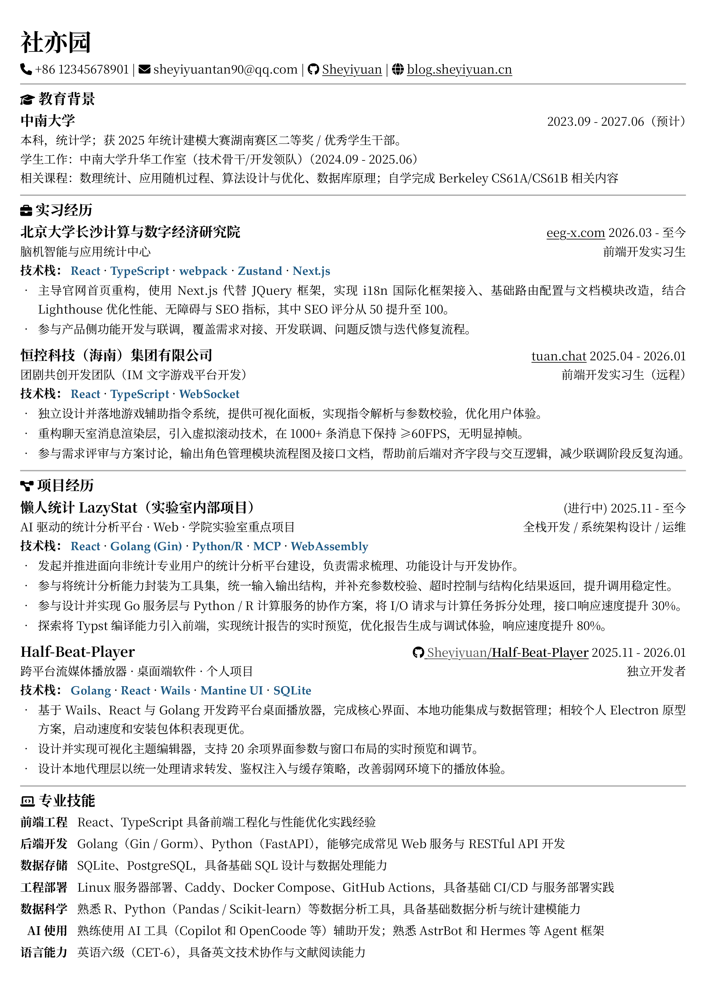

## Step1：什么样的简历是好简历

原本我是觉得，我的简历已经是很糟糕的了，直到这两天我在 boss 直聘上面刷简历的时候才发现，原来我的简历已经算是非常合格的了。因为我看到的很多简历，甚至是一些临近毕业的应届生的简历，不说让我觉得不忍直视，也算得上是惨不忍睹了。

结合我在 boss 直聘上看到的简历信息情况，真正达到合格标准的比例并不高。好的简历应该做到以下几点：

**形式与基本功（底线要求）**

- 正式书面用语，没有错别字和语病
- 排版规整，字体清晰易读，用 PDF 文件

**内容与策略（拉开差距）**

- 重点突出，信息密度高，和 JD 要求匹配
- 层次分明，表述清晰，有可量化的数据指标
- 扬长避短，可以包装但是绝不能造假

可以看出来，上面这几点都应该是一份简历最基本最简单的要求，但是很多同学连这些最基本的要求都做不到。接下来我们就来逐点梳理，大家可以对照自己的简历来一步步优化。

## Step2：如何写出好的简历

### 语言要得体

简历是一份很严肃正式的文件，一定要清楚简历（resume）和个人主页（profile 和 homepage）的区别。个人主页是一种偏向非正式场合的社交媒体，与朋友圈没有太大的区别，在里面你可以自嘲可以幽默可以玩梗（尽管如此也应当注意尺度）；但是简历是一种与他人建立正式关系的信息载体，这种正式场合请使用书面语。

我能够理解很多理工科的同学高考前的语文都是为了应付考试，高考之后除了小说网文和少量文档，大概率没有什么与文字打交道的时候。但是简历不求你写的多么华丽，至少你应该保证简历里面没有错别字、语病和标点符号的误用。标点符号的用法请参考 [《标点符号用法国家标准》](https://openstd.samr.gov.cn/bzgk/std/newGbInfo?hcno=22EA6D162E4110E752259661E1A0D0A8&refer=outter)，排版风格请参考 [《中文文案排版指北》](https://github.com/sparanoid/chinese-copywriting-guidelines/blob/master/README.zh-Hans.md)，在这些最简单的细节上不要出错。

再不济，你用 AI 检查一遍你写的内容，然后自己仔细阅读一遍，尽量把这些文字本身的低级错误改掉。不只是简历，你留下的所有文档和笔记都应该按这样的要求来约束自己，养成良好的习惯。

### 排版的最佳实践

我先说一个暴论——除非你是真正熟悉 Word 的用户，否则不要用 Word 文档写简历，更不要去用各种花里胡哨的模板。

先说说 Word 文档这个格式，有在多台电脑上协作过 Word 的同学应该都遇到过同一份文档在两台电脑上显示不一致，字体缺失，甚至页面完全乱掉的现象。其呈现效果是因打开的软件而异的。因此，最好使用在各种设备上显示完全一致并且内嵌字体的 PDF 格式。

简历的首要要求是排版规整和清晰易读，很多简历模板看着展示的样子很好看和炫酷，但是有几个重要的问题：

1. 大部分模板的呈现效果通常取决于承载的内容，模板的卖家秀里面的文字数量和结构都是针对这个模板定制的，我们自己的简历内容套用模板往往不能体现模板原来的美感，甚至会变成扣分。
2. 很多模板为了追求所谓「设计感」会使用大块的颜色和酷炫字体，有些字体会让易读性大大降低。HR 初筛一份简历的时间往往只有几十秒，看不清的字体只会让 HR 厌恶然后换下一份简历。
3. 很多中大厂会用简历解析系统通过机器提取关键词，部分模板花哨的排版往往在提取关键字时出现错误，导致简历可能符合条件但是被系统筛掉的情况。
4. 很多在页面边缘位置填充色块的模板，尤其是一类喜欢用色块填充侧边栏的模板，对于打印来说是相当不友好的，如果你需要用到纸质简历，没有出血的这类模板不仅打印成本高，而且效果差。

对于简历来说，Word 实在不能算是一个好的选择。有些同学可能也听说过用网页写简历的说法，但是简历作为一个很多时候需要用纸质文档承载的，网页的在线简历仅能作为一个辅助。

推荐使用 LaTeX 和 Typst 这类基于标记语言的专业排版系统来完善简历。

首先，这类排版系统是出版社和专业期刊使用的工业级标准，输出的 PDF 轻量体积小并且像素级对齐，保证排版的稳定性。

其次，这类排版系统使用类似 HTML 和 Markdown 的纯文本源代码编译，不仅可以通过注释快速调整内容，还能够方便地使用 Git 进行版本管理。

由于 LaTeX 的生态虽然丰富，但是管理犹如 C++ 的工具链和依赖库一样又乱又重，对于简历来说有些杀鸡用牛刀的意味，我们更推荐轻量且语法更简单的 Typst 作为简历的编写工具——这是一个语法类似大家熟悉的 Markdown 的专业级排版系统，对照官方社区中文文档 20 分钟左右就能上手。

同时这里我提供一份简历模板供大家使用参考：

::github{repo="Sheyiyuan/resume-template"}

效果如下：

### 简历不是流水账

从内容的组织上来说，我们的简历通常会按照时间逆序排列，即先写时间最近的经历。同时按照重要程度倒序排列，形成一个类似新闻稿的倒金字塔结构。

尽管如此，很多同学的简历还是写出了一种流水账的感觉。

具体来说，就是只写「做了什么」，不写「做成了什么」。比如「参与 XX 系统后端开发，使用 Spring Boot 和 Redis」——这样的描述放在简历上，和没写差别不大。因此我们需要把这些事情包装好成为一个具体的案例。

使用 STAR 法则给每段经历套一个模板：情境（Situation）、任务（Task）、行动（Action）、结果（Result）。对简历来说，结果最重要，而且必须量化。举个例子：

- **流水账**：「负责官网的维护和重构。」
- **可读的**：「在维护官网时发现原本官网存在的性能和 SEO 问题，主导官网首页重构。使用 Next.js 代替 JQuery 框架，实现 i18n 国际化框架接入、基础路由配置与文档模块改造，结合 Lighthouse 优化性能、无障碍与 SEO 指标，其中 SEO 评分通过 Lighthouse 实测从 50 提升至 100。」

再小的事情也能提炼出数字，数字不用惊天动地，但要真实可考证，不要为了量化而编造数字。这样简历就不再是流程记录，而是能力的可视化证明。

另外，很多简历会写「熟悉 Java、Python、MySQL、Redis、Docker……」但没有标注熟练程度。可以建议：如果技能较多，可以按熟练度分组（熟悉 / 了解），或者用项目佐证，避免「堆砌关键词」。

### 信息密度与 JD 匹配

很多同学习惯一份简历海投所有岗位。投后端岗位时，大段描写一个 Web 开发课程设计；投前端时，详细列举学生会策划活动。这些和岗位无关的信息不仅占版面，还会让 HR 觉得你根本没仔细读过这个职位的要求。

我的建议是，至少每投一类岗位，有条件的话部分岗位甚至可以再单独地，都专门针对 JD 做一次「内容提纯」。这也是我前面建议大家用 Typst 做简历的一个原因——用 Git 的不同分支来管理不同岗位的简历。

在投递前，我们把 JD 里的关键技术栈、业务场景和软技能找出来，对照着把自己的经历往这些关键词上靠。比如 JD 要求「熟悉分布式系统设计」，你就把项目里涉及多服务协作、消息队列的部分重点展开；JD 提到「熟悉富文本渲染」，你就把处理文档树的细节写上。用 JD 的语言来描述你的经历，HR 才最容易对上号。

同时，应届生简历请严格控制在**一页**。无关信息果断删：不要写「熟练掌握 Office」（除非岗位的确需要），与专业无关的社团经历和学生干部经历也删掉（部分央国企除外）。确保留下来的每一行都有价值。请一定要尝试换位思考一下：假设我是 HR，这份简历的候选人能不能满足我公司招聘的需求。

### 包装与造假的界限

这里我们再来说一下包装和造假的界限在哪里。

包装是你对于已经掌握的知识和技术支持但是你没有真正做过的事情，以一种合理的形式呈现在你的简历上。将你深度理解、能在面试中彻底讲透的技术模块，作为个人项目或深度参与经历呈现，但要确保描述与你的真实认知水平严格匹配，绝对不虚构角色和职责。除了我们上面介绍的对于自己已有经历的深挖，还有另一种形式。

> 以下讨论仅代表技术面试中的常见现象，从职业道德角度，我依然建议尽量基于真实经历；但如果你确实具备能力而缺少对应经历，可以按照下述方式重构描述，前提是你能完全消化其中的技术细节。

举个例子，半拍同学在一段实习中，主要负责整理文档和做一些边缘功能的开发（大部分公司的实习其实都是如此），但是她通过阅读项目其他模块的代码，完全理解了某个核心功能的实现，并且在她的简历上写下了在另一个个人项目中独立完成这个核心功能的研发，并且能够在面试时针对相关的提问对答如流。

上面这样的情况也是一种处于「灰色地带」的包装——你可能有某种能力，但是并没有与之匹配的经历，你完全就可以把这一段别人做的事情搬到自己身上，而面试官很多时候是无法查证这一点的，这就是一种包装。

**但是！重点来了，如果你完全没有理解他人所作的工作就把这个功能的开发写到了你的简历上，并且你在面试中被问到相关内容的时候还一问三不知，那么这就是造假了。**

抛开一些基本的纯记忆性的八股外，很多东西能不能答上来就直接决定了面试官对你的印象。所以其实关键就在于，你简历上的内容，是否相比于你的实际水平有太多水分。因此切忌使用「精通」这样的词汇，连行业顶尖都不敢说自己精通的东西，我们一个应届生真的没有资格说精通。甚至就是「熟悉」这样的词，也要谨慎使用。

我举一个最简单的例子，我面试了不少同学，他们的简历上都有「熟练使用 Linux」，然后我都问了一个最简单的问题：「怎么在日志文件中查找某个关键词？」

能答出来这个问题的人寥寥无几，大部分人连 `grep` 这样的关键词都说不出来。实际上这是一个只要真正使用过 Linux 服务器的人一定遇到过的问题，因此你包装出来的那个「熟悉」一旦露出马脚就可能会变成你给自己挖的坑。

同理，如果你的 GitHub 和个人主页没有经过打磨，比如个位数的年 contribute 和充斥着浓厚 AI 味的个人网站就不要放上去了，这同样是一种给自己挖坑的行为。

另外，有些东西是**绝对不能造假**的：你的学历、专业、背景等等能够被查证且涉及到基本诚信底线的内容，是绝对不可以造假的。除了这些红线，面试官衡量的是你实际的技术理解和沟通能力。如果包装的内容你完全吃透并能流畅应答，通常不会被追究；但如果连基本原理都说不清，那就是给自己埋雷。

## Step3：怎么「使用」简历

简历不仅是我们求职时的个人信息载体，更应该是帮助我们学习和进步路上的活地图。接下来我们就来讨论如何利用简历来帮助我们学习。

### 再谈包装

正如在上一节结尾我们说到的，简历上的内容一定要是我掌握的内容。那么我们可以把简历反过来用：

**不是我会什么，我在简历上写什么；而是我在简历上写了什么，我就要会什么。**

因为我们能够写在简历上的包装，往往是在我们原本水平的基础上适当拓宽，因此简历上的条目实际上是非常适合作为一个短期的学习目标的——当然你如果没有按照上一章节中的指导来认真撰写而只是自己（或者用 AI）在简历上面胡编乱造、鬼画桃符那就另当别论了。

我们可以在每次包装简历后，选择其中一两点自己认为和自己的真实情况差异较大的内容，以此为目标学习和探索。

我们回到上一节中半拍同学的例子，半拍在简历上写了自己独立完成该功能后，在自己的另一个项目里尝试复刻了这个功能，并在这个过程中熟悉了一些之前光看代码时没有遇到的问题。

这就是一个正向的循环，正确的利用简历包装的点来帮助我们取得实际的进步。

### 何时更新简历？

对于初学者，我建议每半个月或者一个月更新一次简历。

首先，初学者往往对于简历如何包装没有概念，半个月一次的练习能够帮助我们快速熟悉包装简历的流程。

其次，初学者开始时把很多东西整理到简历上的一个条目时，是会有很强的正反馈的，这能够帮助我们更好地坚持学习下去。

最后，这是一个很好的督促自己学习的方式，对于初学者而言，如果简历一个月没有任何能够用于更新的经历或技术学习，就应该思考自己的学习状态或者方法是不是出现了问题。

### 日拱一卒，功不唐捐

其实最难的事情在于坚持，包括我在内的很多同学可能都经常感到焦虑，担心自己每天学的东西和做的事情有没有白费。万事开头难，很多同学刚开始优化简历的时候会感觉自己很痛苦：没有东西可以写，写上去的东西包装后有过短暂的满足，随后却因为感觉和 JD 的要求都还差十万八千里而陷入更深的内耗和虚无中。

但是焦虑和内耗是我们要尽量避免的，适当休息放松自己然后把更多经历用在学习上不断提升自己，只要简历上的条目经历不断清晰，我们自己的能力也在不断提高，那我们就在走正确的路。
