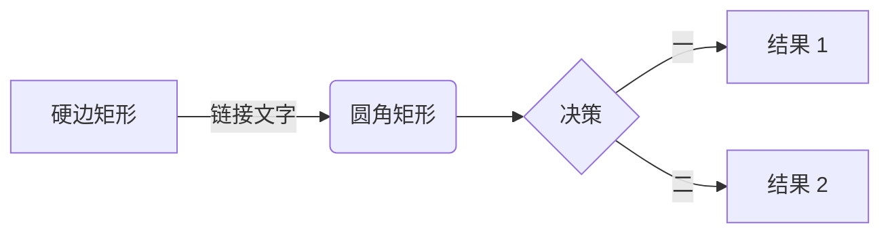

本指南涵盖了本博客支持的所有 Markdown 语法、扩展功能和自定义组件。

## 1. 基础 Markdown

完全支持标准的 Markdown 语法。

### 排版

**用法:**

````markdown
**加粗文本**
*斜体文本*
`等宽代码`
~~删除线文本~~
````

**渲染效果:**

**加粗文本**, *斜体文本*, `等宽代码`, ~~删除线文本~~

### 列表

**无序列表:**

````markdown
- 项目 1
- 项目 2
  - 子项目 A
  - 子项目 B
````

**渲染效果:**

- 项目 1
- 项目 2
  - 子项目 A
  - 子项目 B

**有序列表:**

````markdown
1. 步骤 1
2. 步骤 2
````

**渲染效果:**

1. 步骤 1
2. 步骤 2

### 引用块

**用法:**

````markdown
> 这是一个引用块。
> 它可以跨越多行。
> > 甚至可以嵌套。
````

**渲染效果:**

> 这是一个引用块。
> 它可以跨越多行。
> > 甚至可以嵌套。

## 2. 扩展语法 (Extended Syntax)

### 表格

**用法:**

````markdown
| 语法        | 描述        |
| :---        |    :----:   |
| 标题        | 标题内容    |
| 段落        | 文本内容    |
````

**渲染效果:**

| 语法        | 描述        |
| :---        |    :----:   |
| 标题        | 标题内容    |
| 段落        | 文本内容    |

### 任务列表

**用法:**

````markdown
- [x] 已完成任务
- [ ] 待办任务
````

**渲染效果:**

- [x] 已完成任务
- [ ] 待办任务

### 脚注

**用法:**

````markdown
这是一个简单的脚注[^1]。

[^1]: 这里是脚注的文本内容。
````

**渲染效果:**

这是一个简单的脚注[^1]。

[^1]: 这里是脚注的文本内容。

## 3. 提示框 (Admonitions)

我们同时支持指令语法 (`:::`) 和 GitHub 风格语法 (`> [!type]`)。

### 可用类型
`note` (笔记), `tip` (提示), `important` (重要), `warning` (警告), `caution` (注意)

### 用法与示例

**指令语法 (Directive Syntax):**

````markdown
:::note
高亮显示用户在快速浏览时应该注意的信息。
:::

:::tip[自定义标题]
帮助用户获得更佳体验的可选信息。
:::
````

**渲染效果:**

:::note
高亮显示用户在快速浏览时应该注意的信息。
:::

:::tip[自定义标题]
帮助用户获得更佳体验的可选信息。
:::

**GitHub 风格语法:**

````markdown
> [!IMPORTANT]
> 用户成功完成任务所必需的关键信息。
````

**渲染效果:**

> [!IMPORTANT]
> 用户成功完成任务所必需的关键信息。

## 4. 媒体组件

### GitHub 仓库卡片

展示带有动态数据的 GitHub 仓库卡片。

**用法:**

````markdown
::github{repo="saicaca/fuwari"}
````

**渲染效果:**

::github{repo="saicaca/fuwari"}

### Bilibili 视频

使用 BV 号嵌入 Bilibili 视频。

**用法:**

````markdown
::bilibili{bv="BV1GJ411x7h7"}
````

**渲染效果:**

::bilibili{bv="BV1GJ411x7h7"}

## 5. 流程图 (Mermaid)

使用 Mermaid.js 渲染流程图、序列图等。

**用法:**

````markdown

````

**渲染效果:**


## 6. 数学公式 (KaTeX)

使用 KaTeX 渲染数学公式。

**用法:**

````markdown
**行内公式:** $E = mc^2$

**块级公式:**
$$
f(x) = \int_{-\infty}^\infty \hat f(\xi)\,e^{2\pi i \xi x} \,d\xi
$$
````

**渲染效果:**

**行内公式:** $E = mc^2$

**块级公式:**
$$
f(x) = \int_{-\infty}^\infty \hat f(\xi)\,e^{2\pi i \xi x} \,d\xi
$$

## 7. 代码块 (Expressive Code)

本博客集成了 Expressive Code，支持丰富的代码块功能。

### 语法高亮与 ANSI

除了常规的语法高亮，还支持渲染 ANSI 转义序列。

**用法:**

````markdown
```ansi
ANSI 颜色:
- 常规: 红 绿 黄 蓝 品红 青
- 粗体:   红 绿 黄 蓝 品红 青

文本格式: 粗体 暗淡 斜体 下划线
```
````

**渲染效果:**

```ansi
ANSI 颜色:
- 常规: 红 绿 黄 蓝 品红 青
- 粗体:   红 绿 黄 蓝 品红 青

文本格式: 粗体 暗淡 斜体 下划线
```

### 边框样式与多标签

支持代码编辑器风格和终端窗口风格，以及多标签页展示。

**代码编辑器:**

````markdown
```html title="src/content/index.html"
<div>文件名注释示例</div>
```
````

**渲染效果:**

```html title="src/content/index.html"
<div>文件名注释示例</div>
```

**终端窗口:**

````markdown
```powershell title="PowerShell 终端示例"
Write-Output "这个窗口有标题！"
```
````

**渲染效果:**

```powershell title="PowerShell 终端示例"
Write-Output "这个窗口有标题！"
```

**多平台代码示例 (Tabs):**

````markdown
```zsh title="终端 (macOS/Linux)"
pnpm install
```

```powershell title="PowerShell (Windows)"
pnpm install
```
````

**渲染效果:**

```zsh title="终端 (macOS/Linux)"
pnpm install
```

```powershell title="PowerShell (Windows)"
pnpm install
```

### 行标记与高亮类型

支持通过行号、范围或正则来标记代码行，并应用不同的颜色样式。

**三种不同的高亮颜色 (mark/ins/del):**

通过 `mark` (默认)、`ins` (插入/绿色)、`del` (删除/红色) 参数来实现不同颜色的高亮。

````markdown
```js {2} ins={3-4} del={5}
function highlightDemo() {
  console.log('默认高亮 (mark/蓝色)')
  console.log('插入样式 (ins/绿色)')
  console.log('也是插入 (ins/绿色)')
  console.log('删除样式 (del/红色)')
}
```
````

**渲染效果:**

```js {2} ins={3-4} del={5}
function highlightDemo() {
  console.log('默认高亮 (mark/蓝色)')
  console.log('插入样式 (ins/绿色)')
  console.log('也是插入 (ins/绿色)')
  console.log('删除样式 (del/红色)')
}
```

**Git 风格的 Diff 高亮:**

可以直接使用 `diff` 语言块，或者在 `diff` 块中通过 `lang="..."` 指定语言以同时获得语法高亮。

````markdown
```diff lang="ts"
  function calculate(a, b) {
-   return a + b; // 旧的实现 (删除)
+   return a * b; // 新的实现 (插入)
    return a / b;
  }
```
````

**渲染效果:**

```diff lang="ts"
  function calculate(a, b) {
-   return a + b; // 旧的实现 (删除)
+   return a * b; // 新的实现 (插入)
    return a / b;
  }
```

### 文本标记

支持高亮行内的特定文本或正则匹配。

**特定文本:**

````markdown
```js "return true"
function demo() {
  return true; // 只有 "return true" 被高亮
}
```
````

**渲染效果:**

```js "return true"
function demo() {
  return true; // 只有 "return true" 被高亮
}
```

**正则匹配:**

````markdown
```ts /ye[sp]/
console.log('yes 和 yep 都会被高亮')
```
````

**渲染效果:**

```ts /ye[sp]/
console.log('yes 和 yep 都会被高亮')
```

### 代码折叠

支持折叠代码块的特定部分 (`collapse={范围}`)。

**用法:**

````markdown
```js collapse={1-4}
// 这是一个默认折叠的代码块区域
// 用户点击展开按钮后才能看到这部分内容
// 这种方式非常适合隐藏
// 各种导入语句或许可证信息
console.log('这行代码默认可见');
```
````

**渲染效果:**

```js collapse={1-4}
// 这是一个默认折叠的代码块区域
// 用户点击展开按钮后才能看到这部分内容
// 这种方式非常适合隐藏
// 各种导入语句或许可证信息
console.log('这行代码默认可见');
```

**多重与嵌套折叠:**

````markdown
```js collapse={2-12, 4-8} 
// 1. 最外层代码
{
  // 2. 第一层折叠开始
  function nested() {
    // 3. 第二层折叠开始 (更深层)
    console.log('这部分在内部折叠里');
    // 3. 第二层折叠结束
  }
  // 2. 第一层折叠结束
}
```
````

**渲染效果:**

```js collapse={2-12, 4-8}
// 1. 最外层代码
{
  // 2. 第一层折叠开始
  function nested() {
    // 3. 第二层折叠开始 (更深层)
    console.log('这部分在内部折叠里');
    // 3. 第二层折叠结束
  }
  // 2. 第一层折叠结束
}
```

### 其他功能

**显示行号:**

````markdown
```js showLineNumbers
console.log('显示行号')
```
````

**渲染效果:**

```js showLineNumbers
console.log('显示行号')
```

**自动换行控制:**

````markdown
```js wrap
// 这是一行非常非常非常非常非常非常非常非常非常非常非常非常非常非常非常非常非常非常非常非常非常非常非常非常非常非常长的代码，如果不开启 wrap 就会出现横向滚动条，开启后会自动换行显示
```
````

**渲染效果:**

```js wrap
// 这是一行非常非常非常非常非常非常非常非常非常非常非常非常非常非常非常非常非常非常非常非常非常非常非常非常非常非常长的代码，如果不开启 wrap 就会出现横向滚动条，开启后会自动换行显示
```


<iframe width="100%" height="468" src="https://www.youtube.com/embed/5gIf0_xpFPI?si=N1WTorLKL0uwLsU_" title="YouTube video player" frameborder="0" allowfullscreen></iframe>
```

## YouTube

<iframe width="100%" height="468" src="https://www.youtube.com/embed/5gIf0_xpFPI?si=N1WTorLKL0uwLsU_" title="YouTube video player" frameborder="0" allow="accelerometer; autoplay; clipboard-write; encrypted-media; gyroscope; picture-in-picture; web-share" allowfullscreen></iframe>

## Bilibili

<iframe width="100%" height="468" src="//player.bilibili.com/player.html?bvid=BV1fK4y1s7Qf&p=1" scrolling="no" border="0" frameborder="no" framespacing="0" allowfullscreen="true"> </iframe>